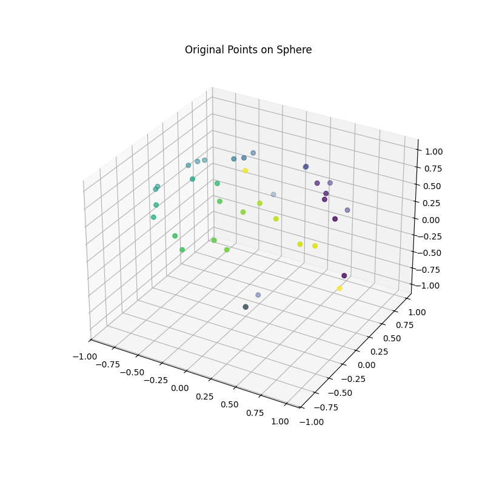
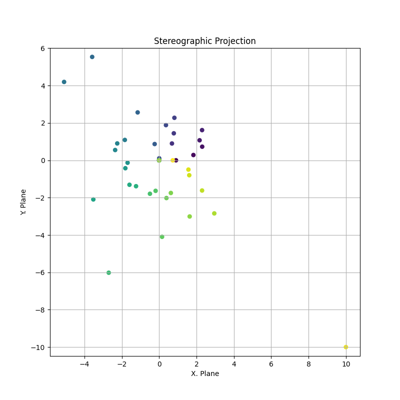
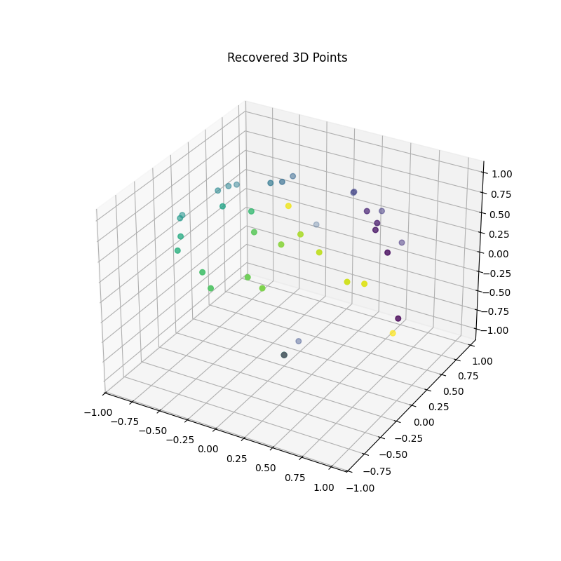

# A Primitive, Highly Insecure, and Conceptual Design

## IMPORTANT NOTE

This code demonstrates mathematical transformations, *not* a real encryption algorithm.  It should *not* be used where security is required. It is trivially reversible and provides no confidentiality.  Any real security would require additional, sophisticated encryption layers.  This code is purely for educational and illustrative purposes.

### Encoding

The message is encoded using a secret key, which defines a key-dependent numeric shift. This obfuscates the message before transmission. The key-based shift is derived from a SHA-256 hash of the secret key.

### Mapping to a Sphere

The encoded message is mapped onto a 3D sphere. Each character corresponds to a point on the sphere.  Numerical values are normalized to the range [-1, 1] and then mapped to spherical coordinates (theta and phi). These spherical coordinates are then converted to Cartesian coordinates (x, y, z) for visualization. The normalization parameters (`min_val` and `max_val`) are stored for later use during recovery.

### Stereographic Projection

The 3D points on the sphere are projected onto a 2D plane using stereographic projection. This transformation provides a more compact representation suitable for storage or transmission. The stereographic projection ensures a unique mapping of points from the sphere to the 2D plane (excluding the north pole).

### Recovery (Inverse Projection)

To recover the message, the 2D points are projected back onto the 3D sphere using the inverse stereographic projection. This reconstructs the original distribution of points. The recovered 3D points are then converted back to numerical values using the stored normalization parameters (`min_val` and `max_val`).

[Details of Stereographic Projection](https://github.com/ratwolfzero/Emergent-Dimension)

### Decoding

The original message is recovered by reversing the key-dependent shift applied during encoding. This restores the text to its readable form. The use of the SHA-256 hash ensures that the same key is used for both encoding and decoding.

**Important:** The program will display *three* plot windows. You must close them in the following order: 1) Original 3D Points, 2) 2D Projection, 3) Recovered 3D Points. Only after closing *all three* plot windows will the recovered message be printed to the terminal.

